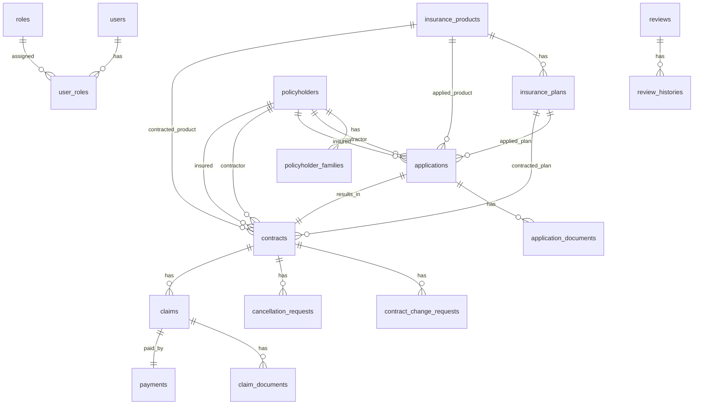

# 31. ER 図（Mermaid）

```mermaid
erDiagram
    users ||--o{ user_roles : has
    roles ||--o{ user_roles : assigned
    insurance_products ||--o{ insurance_plans : has
    policyholders ||--o{ policyholder_families : has
    policyholders ||--o{ applications : contractor
    policyholders ||--o{ applications : insured
    insurance_products ||--o{ applications : applied_product
    insurance_plans ||--o{ applications : applied_plan
    applications ||--o{ application_documents : has
    applications ||--|| contracts : results_in
    policyholders ||--o{ contracts : contractor
    policyholders ||--o{ contracts : insured
    insurance_products ||--o{ contracts : contracted_product
    insurance_plans ||--o{ contracts : contracted_plan
    contracts ||--o{ contract_change_requests : has
    contracts ||--o{ cancellation_requests : has
    contracts ||--o{ claims : has
    claims ||--o{ claim_documents : has
    claims ||--|| payments : paid_by
    reviews ||--o{ review_histories : has
```

## 補足

`reviews.target_id` はポリモーフィック設計のため、ER 図では通常の外部キー線を引いていない。  
実装上は `review_type` と `target_id` の組で審査対象を識別する。
